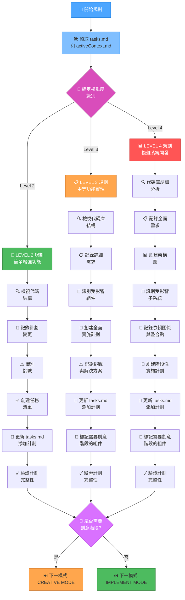
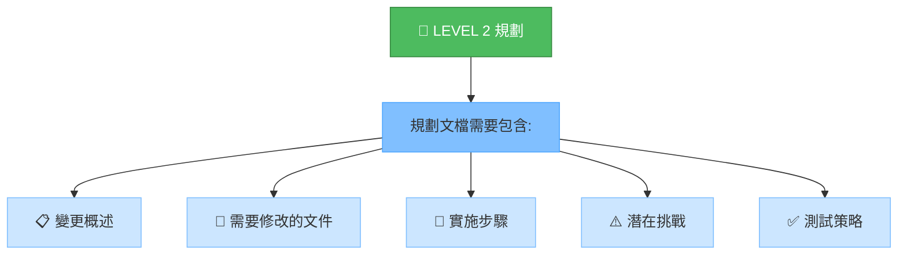
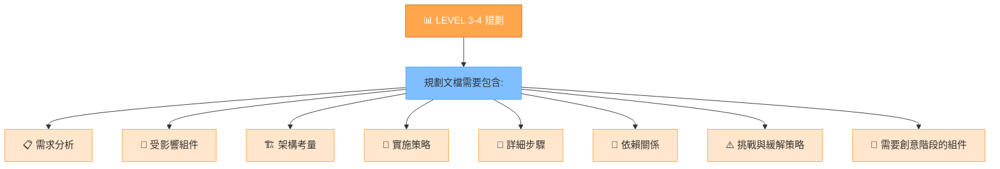
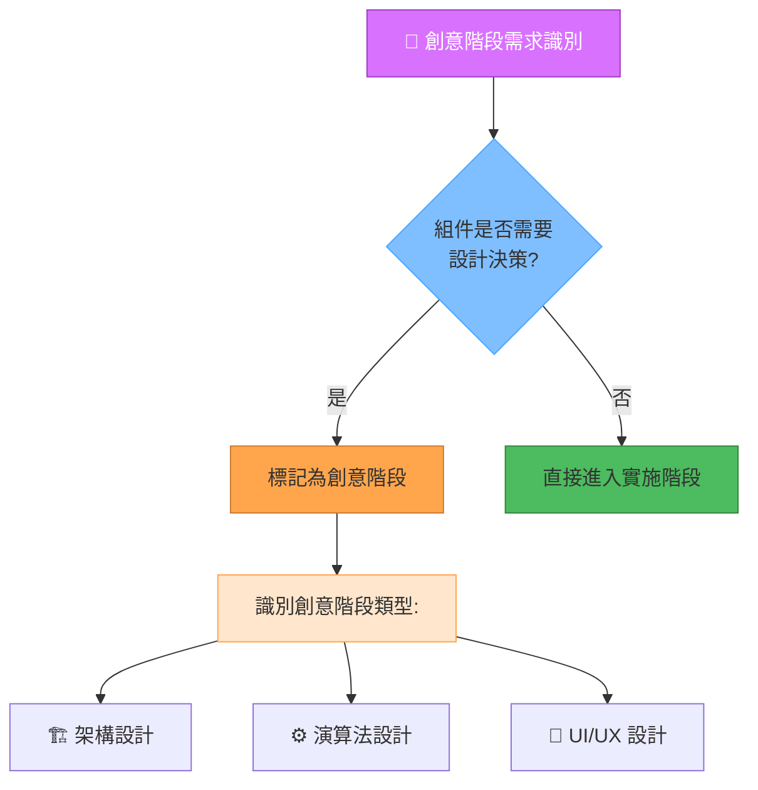
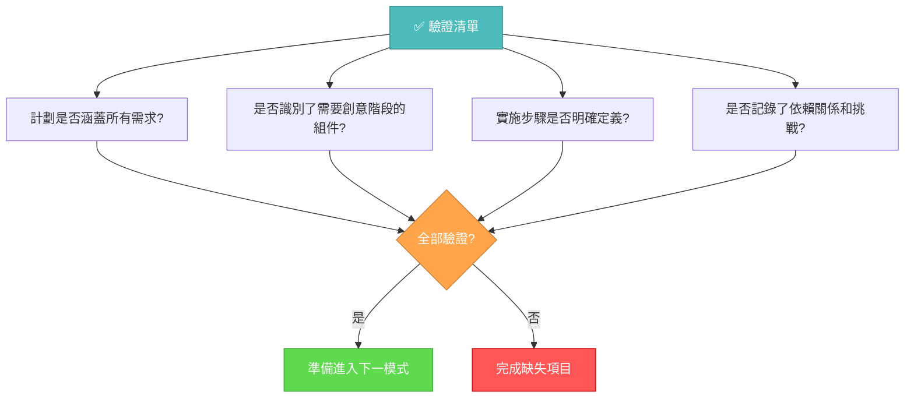

# PLAN MODE MAP

> **TL;DR:** PLAN MODE 專注於任務規劃和設計決策，根據任務複雜度採用不同規劃策略，建立詳細的實施計畫和識別需要創意階段的組件。

## 🧭 PLAN MODE 工作流程



## 📊 複雜度級別與規劃方法

### Level 2: 簡單增強功能規劃



#### Level 2 規劃步驟:
1. 檢視需求並確定範圍
2. 分析相關代碼結構
3. 識別需要修改的文件
4. 設計簡單的實施計劃
5. 預測可能的挑戰和解決方案
6. 更新 tasks.md 添加計劃

### Level 3-4: 全面規劃



#### Level 3-4 規劃步驟:
1. 進行深入的需求分析
2. 識別所有受影響的組件和子系統
3. 考慮架構影響和設計決策
4. 制定分階段實施策略
5. 識別並記錄依賴關係
6. 預測挑戰並準備緩解策略
7. 標記需要創意階段的組件
8. 更新 tasks.md 添加詳細計劃

## 🎨 創意階段需求識別



## 📋 規劃文檔模板

### Level 2 任務模板

```markdown
# [功能名稱] 計劃

## 變更概述
- 目標：[簡潔描述目標]
- 範圍：[定義功能範圍]

## 需要修改的文件
- [文件路徑 1]: [預期變更]
- [文件路徑 2]: [預期變更]

## 實施步驟
1. [步驟 1]
2. [步驟 2]
3. [步驟 3]

## 潛在挑戰
- [挑戰 1]: [可能的解決方案]
- [挑戰 2]: [可能的解決方案]

## 測試策略
- [測試方法 1]
- [測試方法 2]
```

### Level 3-4 任務模板

```markdown
# [功能名稱] 計劃

## 需求分析
- **核心需求**:
  - [ ] [需求 1]
  - [ ] [需求 2]
- **技術限制**:
  - [ ] [限制 1]
  - [ ] [限制 2]

## 組件分析
- **受影響的組件**:
  - **[組件 1]**:
    - 變更需求: [描述]
    - 依賴關係: [描述]
  - **[組件 2]**:
    - 變更需求: [描述]
    - 依賴關係: [描述]

## 設計決策
- **架構**:
  - [ ] [決策 1]
  - [ ] [決策 2]
- **UI/UX** (如適用):
  - [ ] [決策 1]
  - [ ] [決策 2]
- **演算法** (如適用):
  - [ ] [決策 1]
  - [ ] [決策 2]

## 實施策略
1. **第一階段: [描述]**
   - [ ] [任務 1]
   - [ ] [任務 2]
2. **第二階段: [描述]**
   - [ ] [任務 3]
   - [ ] [任務 4]

## 測試策略
- **單元測試**:
  - [ ] [測試 1]
  - [ ] [測試 2]
- **整合測試**:
  - [ ] [測試 3]
  - [ ] [測試 4]

## 文檔計畫
- [ ] [文檔 1]
- [ ] [文檔 2]

## 創意階段需求
- [ ] 🏗️ 架構設計: [描述需求]
- [ ] ⚙️ 演算法設計: [描述需求]
- [ ] 🎨 UI/UX 設計: [描述需求]

## 檢查點
- [ ] 需求確認完成
- [ ] 創意階段完成
- [ ] 實施測試完成
- [ ] 文檔更新完成

## 當前狀態
- 階段: 計畫階段
- 狀態: 進行中
- 阻礙: [如有]
```

## ✅ 驗證清單



## 📝 文件使用指南

在 PLAN MODE 中，應創建以下文檔：

1. 每個任務的詳細計劃文檔 (存放在 `memory-bank/plan-[任務名稱].md`)
2. 綜合計劃概述文檔 (存放在 `memory-bank/plan-綜合計畫概述.md`)
3. 更新 `memory-bank/tasks.md` 添加計劃標記和複雜度評估
4. 更新 `memory-bank/activeContext.md` 反映當前計劃狀態

## 🚀 模式轉換指南

### 完成 PLAN MODE 的條件
- 所有任務的詳細計劃文檔已創建
- 綜合計劃概述已完成
- 任務優先級已確定
- 需要創意階段的組件已識別

### 轉換至 CREATIVE MODE
如果識別出需要創意階段的組件，應先轉換至 CREATIVE MODE 進行設計探索和決策。

### 轉換至 IMPLEMENT MODE
如果沒有需要創意階段的組件，或創意階段已完成，可直接轉換至 IMPLEMENT MODE 開始實施計劃。
